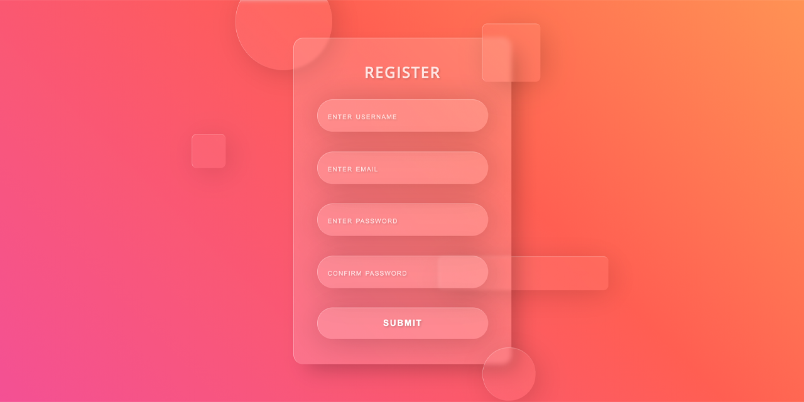

<p id="header"><p>

<table><tr>
<td> <a href="https://github.com/emjose/opening-crawl/#header"></a> </td>
<td> <a href="https://github.com/emjose/one-hundred/#header"></a> </td>
<td> <a href="https://github.com/emjose/parallax-background/#header"></a> </td>
</tr></table>

<br>

<p id="project-title"><p>

<a href=#table-of-contents></a> 

<br>

<a href="https://emjose.github.io/form-validation/"></a> 

#

<p id="table-of-contents"><p>

<a href=#table-of-contents></a>  

- [100 Days of Code](#100days)
- [Installation](#installation) 
- [Live Site](#live-site)
- [Resources](#resources)
- [Let's Connect!](#lets-connect) 

#

<p id="100days"><p>

<a href=#100days></a>  

#### Day 14: February 20, 2021
- I completed the form validation project from the <a href="https://www.udemy.com/course/50-projects-50-days/">50 Projects in 50 Days Udemy course</a>. 
  
- The form validation project is also available in <a href="https://www.youtube.com/channel/UCeU-1X402kT-JlLdAitxSMA">Florin Pop's</a> YouTube <a href="https://youtu.be/rsd4FNGTRBw">tutorial</a>.

- For the form, I also applied <a href="https://glassmorphism.com/">Glassmorphism UI</a> and animations.

#

<p id="installation"><p>

<a href=#installation></a>

#### Git clone and cd into the repo folder:
``` 
git clone git@github.com:emjose/form-validation.git && cd form-validation
```
#### Run the command:
```
open index.html
```

#

<p id="live-site"><p>

<a href="https://emjose.github.io/form-validation/"></a>  

<a href="https://emjose.github.io/form-validation/"></a>
Validations check for empty or invalid fields.
<br>
<br>
<a href="https://emjose.github.io/form-validation/"></a>
Required fields passing validations.

#

<p id="resources"><p>

<a href=#resources></a>  

- #### [Source Code by Florin Pop](https://codepen.io/FlorinPop17/pen/OJJKQeK)

- #### [Glassmorphism CSS Generator](https://glassmorphism.com/)
  
- #### [Form Validation Tutorial](https://youtu.be/rsd4FNGTRBw) by [Florin Pop](https://www.youtube.com/channel/UCeU-1X402kT-JlLdAitxSMA) 
  
- #### [Glassmorphism Effects Login Form ](https://youtu.be/hJQ_WL-w590) by [Animation Coding](https://www.youtube.com/channel/UCnzIhXjOKIOgB3nIdOKJshQ)

- #### [50 Projects In 50 Days - HTML, CSS & JavaScript](https://www.udemy.com/course/50-projects-50-days/) by [Brad Traversy](https://www.youtube.com/user/TechGuyWeb) and [Florin Pop](https://www.youtube.com/channel/UCeU-1X402kT-JlLdAitxSMA)

#

<p id="lets-connect"><p>

<a href=#lets-connect></a>

<p><a href="https://twitter.com/Emmanuel_Labor"> <a href="https://www.linkedin.com/in/emmanuelpjose/"> <a href="https://emmanueljose.medium.com/"> <a href="https://www.instagram.com/emmanuel_jose/"> <a href="mailto:emjose@gmail.com"> <a href="https://www.youtube.com/channel/UCQdqFg-_J83jn9xJRd1W3tQ/videos"> <a href="https://github.com/emjose"></p>

#

<a href=#header></a>